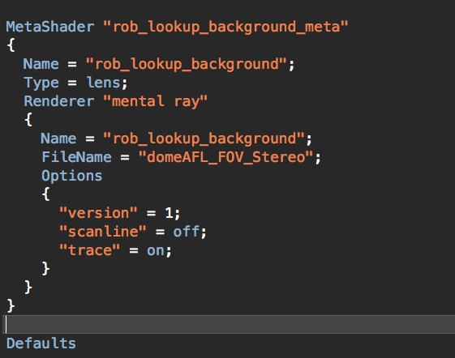
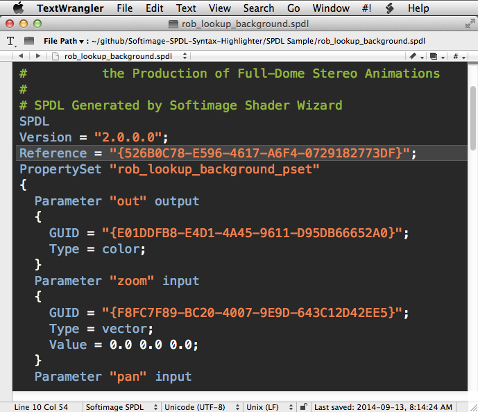
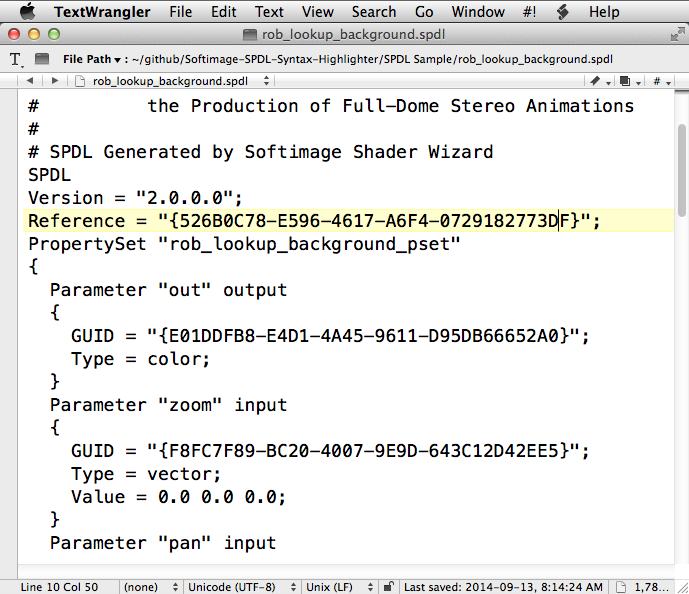
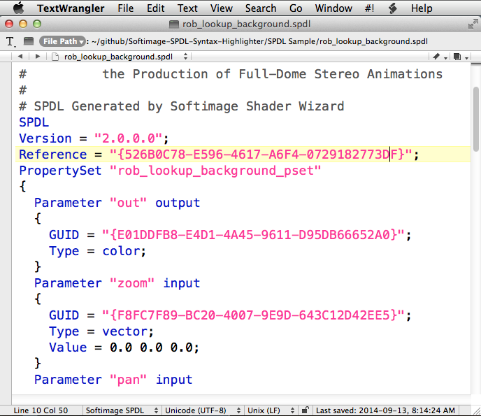
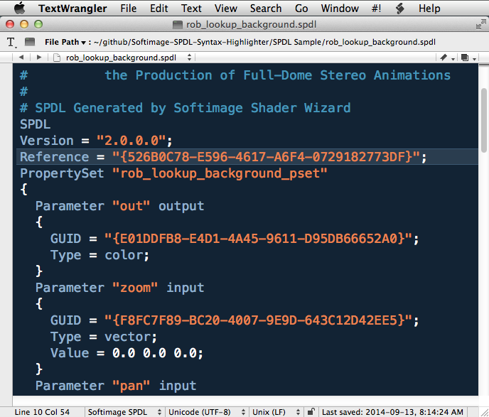

# BBEdit and TextWrangler Softimage SPDL Codeless Language Module  #
**Version 1** Released September 15, 2014
by Andrew Hazelden

## Overview ##
I would like to present a new BBEdit and TextWrangler syntax highlighting module that works with code from Softimage SPDL files. The new modules make it easier for a VFX artist or technical director to edit a Softimage SPDL document with an external text editor and this can speed up your development process on porting shaders, etc...

**Note:** This syntax highlighting module requires either [TextWrangler (free)](http://www.barebones.com/products/textwrangler/) or [BBEdit](http://www.barebones.com/products/bbedit/) from Bare Bones Software.

## Download ##

The Softimage SPDL Highlighter module is a free download.

You can download the latest version on GitHub here:   
[https://github.com/AndrewHazelden/Softimage-SPDL-Syntax-Highlighter/](https://github.com/AndrewHazelden/Softimage-SPDL-Syntax-Highlighter/)

## Installation ##

**Step 1.**  [Download TextWrangler](http://www.barebones.com/products/textwrangler/) and install it on your system. If you own a copy of [BBEdit](http://www.barebones.com/products/bbedit/) you can use it instead. After you install the software, run it once to create the preference folders.

**Step 2.**  Copy the "Softimage SPDL.plist" file from the **install** folder to your Language Modules folder.

If you are using TextWrangler the module belongs in this folder:  
    ~/Library/Application Support/TextWrangler/Language Modules/

If you are using BBEdit the module belongs in this folder:  
    ~/Library/Application Support/BBEdit/Language Modules/

On Mac OS X Lion / Mountain Lion / Mavericks you can open the hidden **~/Library** folder by switching to the Finder. From the "Go" Menu select, "Go to Folder..." or press the hotkey **Shift-Command-G**.

Paste in the Languages Module folder path and hit "go". 

If you are running Mountain Lion and the BBEdit / TextWrangler "Language Modules" folder doesn't exist you can create the folders manually. A quick way to create the folders is to use the terminal:

TextWrangler Folder Creation Command:  
> mkdir -p ~/"Library/Application Support/TextWrangler/Language Modules/"

BBEdit Folder Creation Command:  
> mkdir -p ~/"Library/Application Support/BBEdit/Language Modules/"

Once you are in the Language Modules folder you can copy the **Softimage SPDL.plist** file in place.

**Step 3.**  We need to restart TextWrangler for the new language module to be listed in the TextWrangler language popup menu.

If you open an Softimage (.spdl) file at this point you will see formatted text. If you are working on a new file without the .spdl extension you can select the language manually.

Open the **Language** popup menu at the bottom left of the text editor window and select **Softimage SPDL**. This will turn on syntax highlighting.

Here is an example Softimage (.spdl) file with syntax highlighting enabled:

## Bonus - Download a Color Scheme ##

If you are new to TextWrangler or BBEdit you will probably want to download a color scheme to customize your work environment. I've written two themes to get you started: The [Charcoal Color Scheme](http://www.andrewhazelden.com/blog/2012/09/charcoal-color-scheme-for-textwrangler-and-bbedit/) and the [Midnight Blue Color Scheme](http://www.andrewhazelden.com/blog/2012/06/midnight-blue-color-scheme-for-textwrangler-and-bbedit/).

This is the view with the [Charcoal Color Scheme](http://www.andrewhazelden.com/blog/2012/09/charcoal-color-scheme-for-textwrangler-and-bbedit/) in action:  

* * *

This is the view with the  [Midnight Blue Color Scheme](http://www.andrewhazelden.com/blog/2012/06/midnight-blue-color-scheme-for-textwrangler-and-bbedit/) in action:  

* * *

I hope this tool improves your coding workflow as you develop new Softimage GUIs using SPDL files with  TextWrangler or BBEdit on a Mac OS X System. I've also created an Softimage SPDL syntax highlighter for Notepad++.

Cheers,  

Andrew Hazelden

Email: [andrew@andrewhazelden.com](mailto:andrew@andrewhazelden.com)   
Blog: [http://www.andrewhazelden.com](http://www.andrewhazelden.com)  
Twitter: [@andrewhazelden](https://twitter.com/andrewhazelden)  
Google+: [https://plus.google.com/+AndrewHazelden](https://plus.google.com/+AndrewHazelden)

