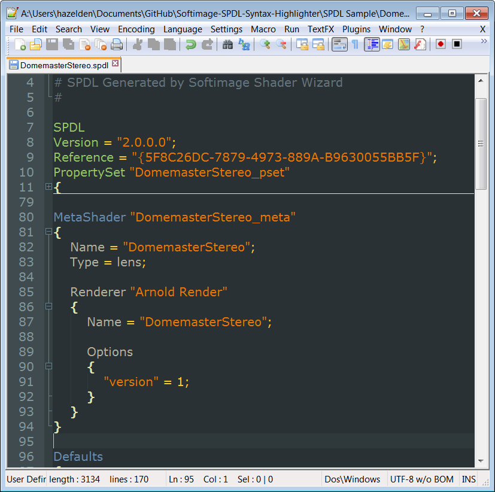

# Softimage SPDL Syntax Highlighter #
**Version 1** Released September 15, 2014  
by Andrew Hazelden

## Overview ##

I've just finished a set of Notepad++, BBEdit, and TextWrangler syntax highlighting modules for Softimage SPDL files. The new modules make it easier for a VFX artist or technical director to edit a Softimage SPDL document with an external text editor and this can speed up your development process on porting shaders, etc...

* * *

I hope this tool improves your coding workflow as you develop new Softimage GUIs using SPDL files with your favorite plain text editors.

Cheers,  
Andrew Hazelden

Email: [andrew@andrewhazelden.com](mailto:andrew@andrewhazelden.com)   
Blog: [http://www.andrewhazelden.com](http://www.andrewhazelden.com)  
